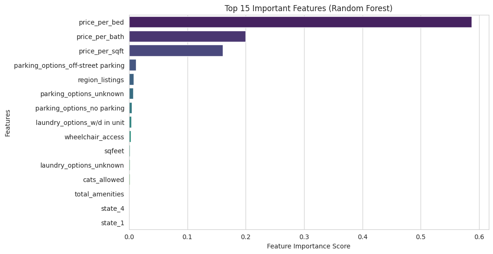
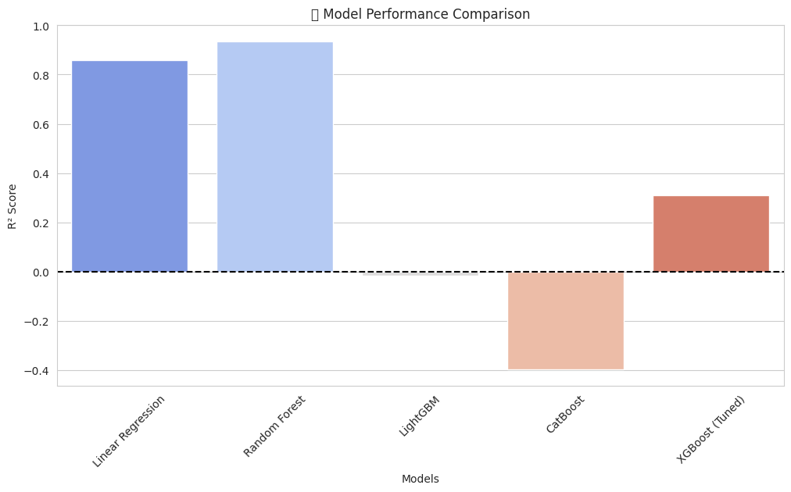

# Smart Real Estate Insights Engine (SRIE)  
### Transforming Real Estate Data into Business-Driven Decisions

---

## About This Project

Hi! This isn’t just another rent prediction model—it’s a **Smart Real Estate Insights Engine (SRIE)** built to deliver actionable insights from real estate data.

This system goes beyond simple predictions by offering real-time rent pricing, interpretability, and anomaly detection through a fully integrated machine learning pipeline.

**Key Capabilities:**  
- Predicts rental prices with high accuracy  
- Explains key factors influencing rent  
- Detects anomalies & pricing outliers  
- Supports strategic real estate investment decisions

---

## Key Components

- `RentPrediction.ipynb`: Full EDA, modeling, and API integration  
- `final_rent_price_model.pkl`: Trained Random Forest model  
- `img/`: All visualizations used to interpret model insights  
- `data/`: Dataset references (excluded in GitHub) You can use data dataset that is in the format as described in the notebook.

---

## Exploratory Data Analysis (EDA)

**"Before predicting, we understand."**

Thorough analysis was conducted to explore pricing trends, regional variability, and data consistency.

**Highlights:**
- Price distribution by region and property type  
- Redundancy removed via correlation analysis  
- Missing data handled using logic-aware imputation

### EDA Visualizations

**Price Distribution Across Regions**  


**Feature Correlation & Importance**  


**Missing Data Handling:**
- Latitude/Longitude imputed via median regional values  
- Categorical nulls labeled as "unknown"  
- Price per square foot derived to fill in key gaps

---

## Data Preprocessing & Feature Engineering

**"Great models start with great features."**

**Transformations Applied:**
- One-hot encoding for categorical attributes  
- Derived `price_per_sqft_region` to reflect demand concentration  
- Removed features with multicollinearity to improve model learning

### Why `price_per_sqft_region`?
- Captures regional pricing dynamics  
- Acts as a proxy for supply-demand ratios  
- Adds economic context to traditional numeric features

---

## Model Selection & Evaluation

**"Not just any model—the right model."**

Several models were evaluated, with Random Forest selected for its performance and interpretability.

| Model               | MAE     | RMSE     | R² Score |
|--------------------|---------|----------|-----------|
| Linear Regression  | 760.11  | 22,349   | 0.857     |
| Random Forest      | **76.29** | **14,993** | **0.936** |
| LightGBM           | 1146.68 | 59,824   | -0.017    |
| CatBoost           | 956.22  | 70,070   | -0.395    |
| XGBoost (Tuned)    | 876.34  | 49,274   | 0.309     |

### Why Random Forest?
- Best overall performance (R² = 0.936)  
- Robust to missing values and feature types  
- Quick inference suitable for deployment  
- Feature importances support interpretability

**Model Comparison Visualization**  


---

## Feature Importance - What Drives Rent Prices?

**"It’s not just about predicting—it’s about explaining."**

Key factors influencing predicted rent:
- Square Footage  
- Number of Bedrooms & Bathrooms  
- Regional Market Trends  
- Parking, Amenities, Accessibility

**Feature Importance Chart**  


---

## Deployment-Ready API with FastAPI

This model is served through a FastAPI application for real-time prediction. It can be integrated with dashboards or external systems.

### How to Run the API

**Install dependencies:**
```bash
pip install fastapi uvicorn joblib pandas scikit-learn
```

**Run the API:**
```bash
uvicorn api_script:app --reload
```

**Open in browser:**
- Swagger UI: `http://127.0.0.1:8000/docs`

### Sample API Call

**Using cURL**:
```bash
curl -X 'POST' 'http://127.0.0.1:8000/predict/' \
-H 'Content-Type: application/json' \
-d '{"sqfeet": 1200, "beds": 3, "baths": 2, "region": "San Diego", "type": "house"}'
```

**Using Python**:
```python
import requests

url = "http://127.0.0.1:8000/predict/"
data = {
    "sqfeet": 1200,
    "beds": 3,
    "baths": 2,
    "region": "San Diego",
    "type": "house"
}

response = requests.post(url, json=data)
print(response.json())
```

---

## Future Improvements

- Hyperparameter tuning with GridSearch or Optuna  
- Interpretability enhancements using SHAP  
- Containerization & scalable deployment via Docker/Kubernetes  
- Integration with cloud-based platforms

---

## How to Run

```bash
git clone https://github.com/MeghanaChillara0203/Smart-Real-Estate-Insights-Engine-SRIE-.git 
cd Rent_Price_Prediction
pip install -r requirements.txt
jupyter notebook RentPrediction.ipynb
```

---

## Final Thoughts

This project combines machine learning, data engineering, and API design to deliver a smart rent prediction engine that supports data-driven decisions in real estate. It transforms raw property data into actionable insights through modeling, explanation, and integration.

**SRIE is more than just a model—it’s a decision-support system built for real-world deployment.**

---
```
MIT License

Copyright (c) 2025 MeghanaChillara0203

Permission is hereby granted, free of charge, to any person obtaining a copy
of this software and associated documentation files (the "Software"), to deal
in the Software without restriction, including without limitation the rights
to use, copy, modify, merge, publish, distribute, sublicense, and/or sell
copies of the Software, and to permit persons to whom the Software is
furnished to do so, subject to the following conditions:

The above copyright notice and this permission notice shall be included in all
copies or substantial portions of the Software.

THE SOFTWARE IS PROVIDED "AS IS", WITHOUT WARRANTY OF ANY KIND, EXPRESS OR
IMPLIED, INCLUDING BUT NOT LIMITED TO THE WARRANTIES OF MERCHANTABILITY,
FITNESS FOR A PARTICULAR PURPOSE AND NONINFRINGEMENT. IN NO EVENT SHALL THE
AUTHORS OR COPYRIGHT HOLDERS BE LIABLE FOR ANY CLAIM, DAMAGES OR OTHER
LIABILITY, WHETHER IN AN ACTION OF CONTRACT, TORT OR OTHERWISE, ARISING FROM,
OUT OF OR IN CONNECTION WITH THE SOFTWARE OR THE USE OR OTHER DEALINGS IN THE
SOFTWARE.
```